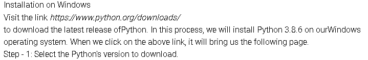
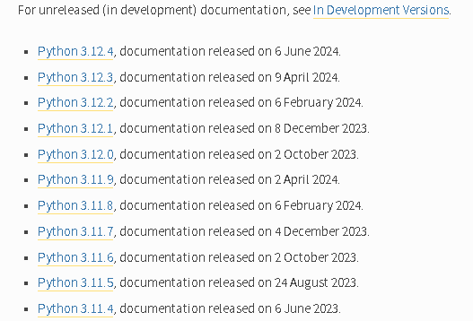
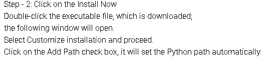
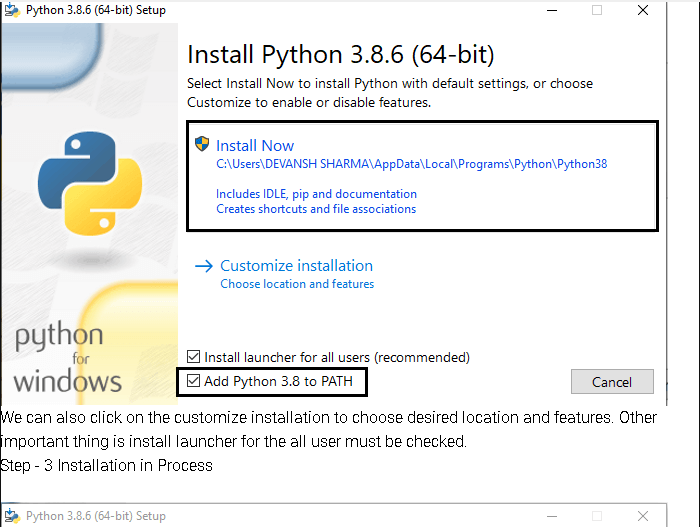
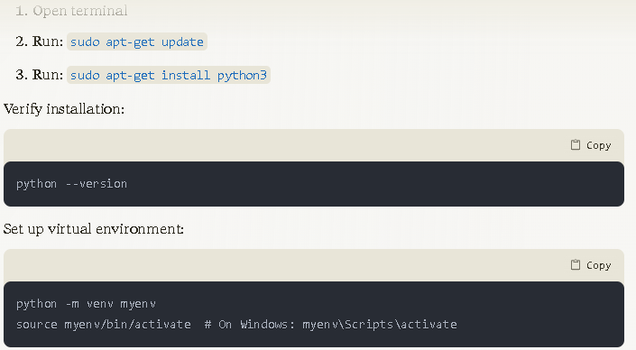

# SE-Assignment-6
 Assignment: Introduction to Python
Instructions:
Answer the following questions based on your understanding of Python programming. Provide detailed explanations and examples where appropriate.

 Questions:

1. Python Basics:
   - What is Python, and what are some of its key features that make it popular among developers? Provide examples of use cases where Python is particularly effective.

Python is a high-level, interpreted programming language known for its simplicity and readability. Key features include:
Easy to learn and read syntax
Dynamic typing
Extensive standard library
Cross-platform compatibility
Strong community support

Python is particularly effective for:
Web development (Django, Flask)
Data analysis and visualization (Pandas, Matplotlib)
Machine learning (TensorFlow, PyTorch)
Scripting and automation

2. Installing Python:
   - Describe the steps to install Python on your operating system (Windows, macOS, or Linux). Include how to verify the installation and set up a virtual environment.
   
   
   
   
   

3. Python Syntax and Semantics:
   - Write a simple Python program that prints "Hello, World!" to the console. Explain the basic syntax elements used in the program.
   <!-- print("Hello world!") -->

4. Data Types and Variables:
   - List and describe the basic data types in Python. Write a short script that demonstrates how to create and use variables of different data type

Basic Python data types:
int: Integer numbers
float: Decimal numbers
str: Strings
bool: Boolean (True/False)
list: Ordered collection
tuple: Immutable ordered collection
dict: Key-value pairs
set: Unordered collection of unique elements
# Integer
age = 30

# Float
height = 1.75

# String
name = "Alice"

# Boolean
is_student = True

# List
fruits = ["apple", "banana", "cherry"]

# Tuple
coordinates = (10, 20)

# Dictionary
person = {"name": "Bob", "age": 25}

# Set
unique_numbers = {1, 2, 3, 4, 5}

print(f"Age: {age}, type: {type(age)}")
print(f"Height: {height}, type: {type(height)}")
print(f"Name: {name}, type: {type(name)}")
print(f"Is student: {is_student}, type: {type(is_student)}")
print(f"Fruits: {fruits}, type: {type(fruits)}")
print(f"Coordinates: {coordinates}, type: {type(coordinates)}")
print(f"Person: {person}, type: {type(person)}")
print(f"Unique numbers: {unique_numbers}, type: {type(unique_numbers)}")

5. Control Structures:
   - Explain the use of conditional statements and loops in Python. Provide examples of an `if-else` statement and a `for` loop.
  # conditional statement

   age = 18

if age >= 18:
    print("You are an adult")
else:
    print("You are a minor")

   # for loop
   fruits = ["apple", "banana", "cherry"]

for fruit in fruits:
    print(f"I like {fruit}") 

6. Functions in Python:
   - What are functions in Python, and why are they useful? Write a Python function that takes two arguments and returns their sum. Include an example of how to call this function.
  
Functions are reusable blocks of code that perform specific tasks. They improve code organization and reusability.
Example function:
def add_numbers(a, b):
    return a + b

# Calling the function
result = add_numbers(5, 3)
print(f"The sum is: {result}")

7. Lists and Dictionaries:
   - Describe the differences between lists and dictionaries in Python. Write a script that creates a list of numbers and a dictionary with some key-value pairs, then demonstrates basic operations on both.

   Lists are ordered, mutable collections. Dictionaries are unordered collections of key-value pairs.

   # List operations
numbers = [1, 2, 3, 4, 5]
print(f"Original list: {numbers}")

numbers.append(6)
print(f"After append: {numbers}")

numbers.remove(3)
print(f"After remove: {numbers}")

# Dictionary operations
person = {"name": "Alice", "age": 30}
print(f"Original dictionary: {person}")

person["city"] = "New York"
print(f"After adding key: {person}")

del person["age"]
print(f"After deleting key: {person}")

8. Exception Handling:
   - What is exception handling in Python? Provide an example of how to use `try`, `except`, and `finally` blocks to handle errors in a Python script.

   Exception Handling enable one to handle errors successufully
   try:
    number = int(input("Enter a number: "))
    result = 10 / number
    print(f"Result: {result}")
except ValueError:
    print("Invalid input. Please enter a number.")
except ZeroDivisionError:
    print("Cannot divide by zero.")
finally:
    print("Execution completed.")

9. Modules and Packages:
   - Explain the concepts of modules and packages in Python. How can you import and use a module in your script? Provide an example using the `math` module.

Modules are Python files containing functions and variables. Packages are directories containing multiple modules.
Example using the math module:
import math

radius = 5
area = math.pi * math.pow(radius, 2)
print(f"The area of a circle with radius {radius} is {area:.2f}")

10. File I/O:
    - How do you read from and write to files in Python? Write a script that reads the content of a file and prints it to the console, and another script that writes a list of strings to a file.
Read from a file
with open("input.txt", "r") as file:
    content = file.read()
    print(content)

write to a file
    fruits = ["apple", "banana", "cherry"]

with open("output.txt", "w") as file:
    for fruit in fruits:
        file.write(fruit + "\n")

# Submission Guidelines:
- Your answers should be well-structured, concise, and to the point.
- Provide code snippets or complete scripts where applicable.
- Cite any references or sources you use in your answers.
- Submit your completed assignment by [due date].

